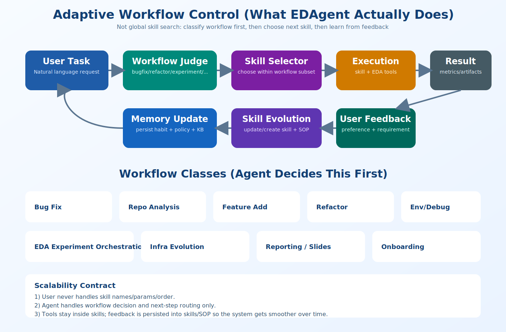

# EDAgent

A deployable, skill-based research agent system for EDA workflows.




## Why EDAgent
EDAgent turns a complex research workflow into a practical product-like experience:
- one-command bootstrap,
- natural-language interaction,
- structured execution with audit artifacts,
- continuous improvement from user feedback.

## 30-Second Start
```bash
git clone https://github.com/Mr-Fang-VLSI/EDAgent.git
cd EDAgent
python3 run_demo.py
```

What `run_demo.py` does:
- verifies core folders,
- runs infrastructure checks,
- refreshes knowledge index,
- prints next-step guidance.

## Core Capabilities
- End-to-end research orchestration: idea -> hypothesis -> experiment -> validation -> retro.
- Dynamic infrastructure maintenance: docs, knowledge, paper, and tool libraries.
- Governed execution: theory-veto gates, audit trails, and rollback-aware updates.
- User-facing reporting: targeted summaries and slide-ready outputs for specific questions.

## Product Experience
- Conversational: users work in plain natural language.
- Adaptive: behavior evolves with user preferences and feedback.
- Self-maintaining: the system can refine SOPs and operational assets over time.

## Typical Use Cases
- Build and iterate EDA research plans quickly.
- Keep paper/knowledge/tool artifacts organized and searchable.
- Run experiment loops with post-run reflection and next-step recommendations.
- Generate concise explanation decks for collaborators/advisors.

## Workflow-First Orchestration
EDAgent routes in two phases for stability and scalability:
1. classify the task into a workflow class,
2. choose the next skill only from that workflow's skill subset.

This avoids global skill search on every turn and keeps routing predictable as skills grow.

## If You Use Codex/Claude-Style Agents
After cloning the repo, you can start auto-deployment with one sentence in chat:

```text
开始部署EDAgent
```

or

```text
Start deploying EDAgent
```

Expected behavior after this trigger:
- verify repo/environment status,
- bootstrap/verify infra folders,
- run guard/audit/index checks,
- ask your research direction and hard constraints.

After clone + `python3 run_demo.py`, ask the agent to continue from your direction and constraints.

Example prompt:
```text
My research direction is placement for dynamic-power reduction.
Constraints: area/timing must not regress.
Please start with a scoped plan, run the first validation loop, and summarize key findings.
```

## Repository Layout
- `agent.md`: top-level governance and orchestration policy.
- `skills/`: modular capabilities (execution, infra maintenance, domain methods).
- `scripts/common/`: reusable infra and indexing utilities.
- `docs/knowledge_base/`: protocol and landscape knowledge.
- `docs/tool_registry/`: tool metadata/catalog.
- `slurm_logs/00_meta/`: governance and audit artifacts.

## Open-Source Scope
- Research and experimentation only.
- No production SLA or warranty.
- Validate outputs independently for high-stakes decisions.

See also:
- `CONTRIBUTING.md`
- `ROADMAP.md`
- `docs/WORKFLOW_CATALOG.md`
